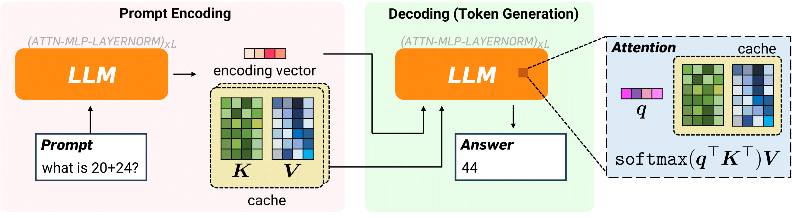
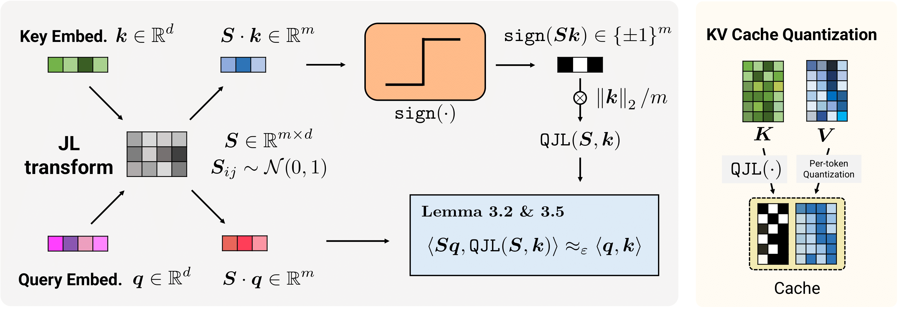
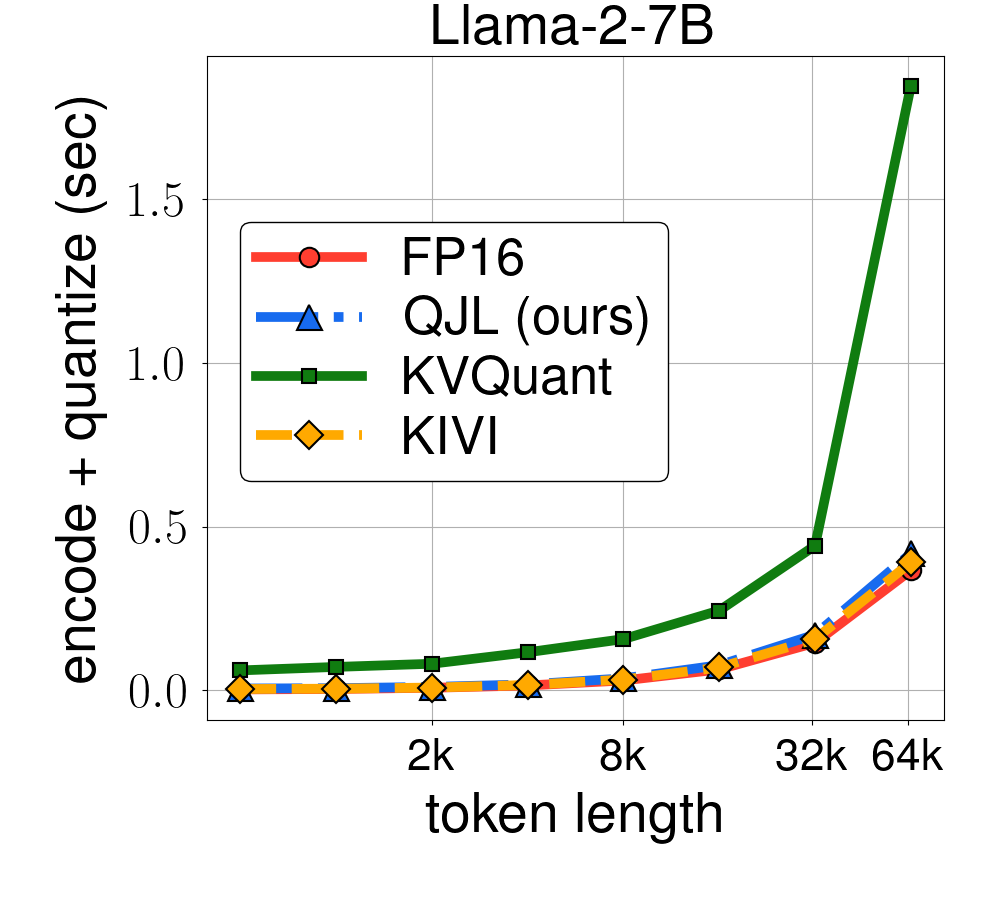
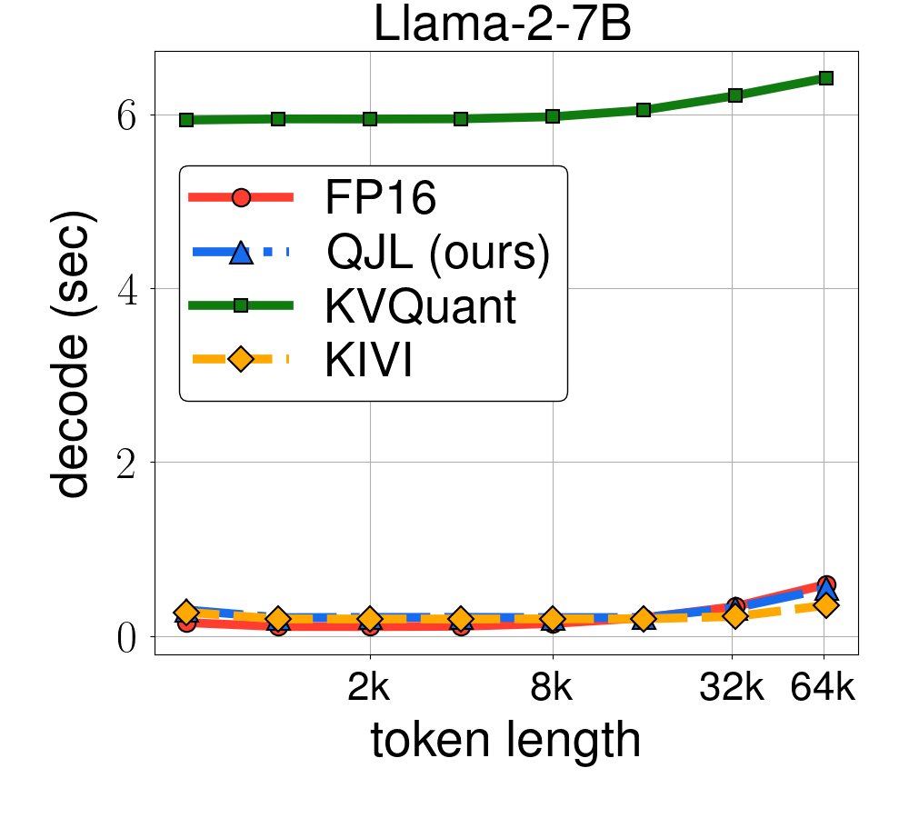
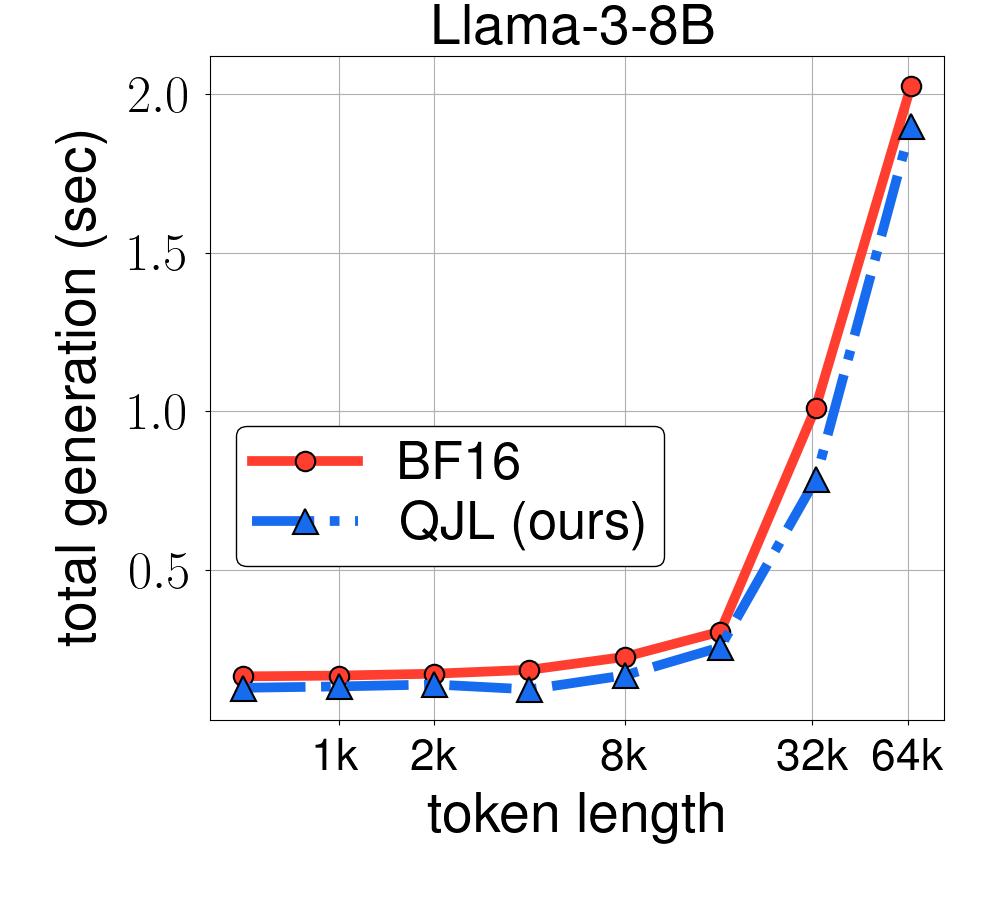

# QJL
[1-Bit Quantized JL Transform for KV Cache Quantization with Zero Overhead](https://arxiv.org/pdf/2406.03482) 


## Overview
QJL (Quantized Johnson-Lindenstrauss) is a novel approach to compress the Key-Value (KV) cache in large language models (LLMs). It applies a Johnson-Lindenstrauss (JL) transform as a preconditioner to the embedding vectors in the cache, then quantizes the transformed vectors to a single sign bit, resulting in a 1-bit representation of the embedding vectors. Preconditioning with the JL transform enables QJL to quantize vectors in the cache to a single bit without needing to normalize the embedding vectors, while providing an unbiased estimator for inner products with minimal distortion. This eliminates memory overheads associated with storing quantization constants, which is common in previous methods.




QJL achieves provably minimal relative distortion on attention scores, effortlessly handles practical challenges like outlier coordinates in key embeddings, and can be enhanced using orthogonalized JL transforms for improved performance. The method is modular and is specifically designed to be efficient and GPU-friendly, with lightweight CUDA kernels for core operations.
The functional block diagram of QJL is shown below.




Experimental results demonstrate QJL's effectiveness across various LLMs, including Llama-2 and Llama-3, on multiple NLP tasks. QJL achieves a significant reduction in KV cache memory usage (3 bits per float vs. 16 bits) while maintaining or slightly improving accuracy compared to baselines and other quantization methods. It also shows faster runtime, especially for long sequences, and supports different precision formats and grouped query attention, making it compatible with newer LLM architectures. Overall, QJL offers a memory-efficient, fast, and accurate solution for KV cache quantization, addressing a significant bottleneck in serving LLMs, particularly for long-context applications.


## Installation
1. Clone the repository:
    ```sh
    git clone git@github.com:amirzandieh/QJL.git
    cd QJL
    ```

2. Install the required packages:
    ```sh
    pip install -r requirements.txt
    ```

3. Set up the QJL kernel:
    ```sh
    cd qjl_kernel
    python setup.py install
    ```

## Evaluate QJL on LongBench

QJL supports Llama 2/3 family models (e.g., ``longchat-7b-v1.5-32k``). To evaluate QJL on LongBench, use the following example :
```sh
python longbench.py --model_name "lmsys/longchat-7b-v1.5-32k" \
    --dtype "float16" \
    --key_quantization_bits 256 \
    --key_quantization_bits_initial_layers 512 \
    --initial_layers_count 15 \
    --outlier_count_general 8 \
    --outlier_count_initial_layers 8 \
    --value_quantization_bits 2 \
    --group_size 32 \
    --buffer_size 128 \
    --seed 42 \
    --dataset_name [dataset_name] \
    --n_data 150
```

### Runtime Evaluation
To produce the runtime experiments from the paper and plot the runtime, sinly run the following command:
```sh
python plot_runtime.py
```
|  |  |  |
|:---------------------------------------------------------------------:|:----------------------------------------------------------------------:|:-----------------------------------------------------:|


### Citation
```
@article{zandieh2024qjl,
  title={QJL: 1-Bit Quantized JL Transform for KV Cache Quantization with Zero Overhead},
  author={Zandieh, Amir and Daliri, Majid and Han, Insu},
  journal={arXiv preprint arXiv:2406.03482},
  year={2024}
}
```
